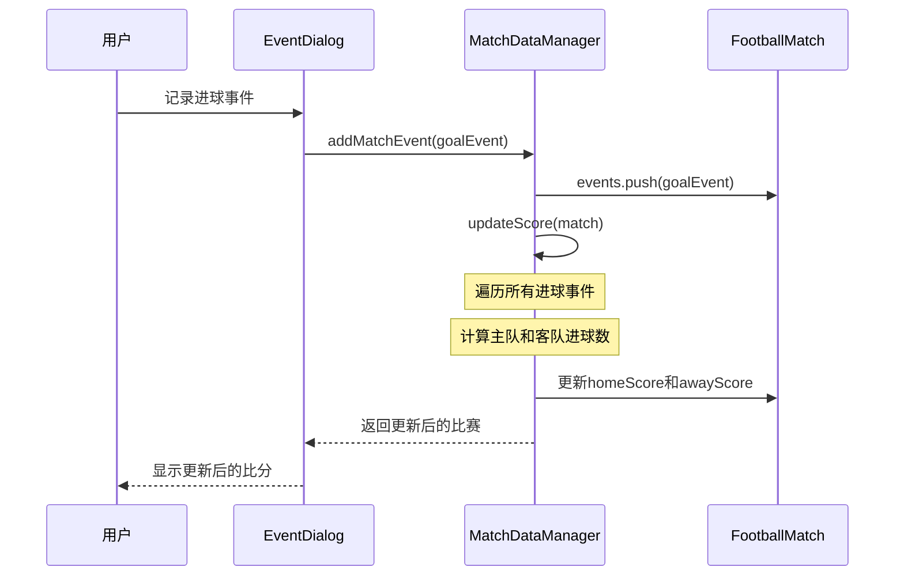
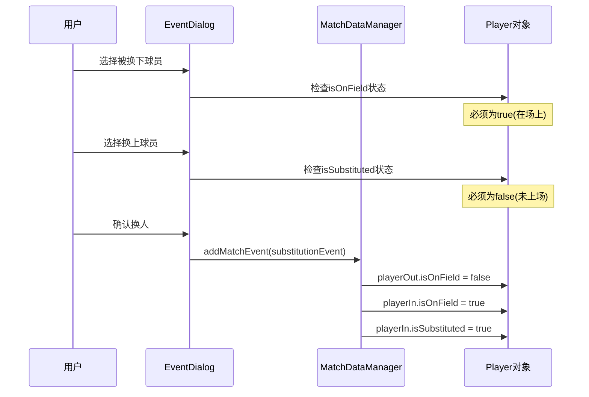

# 技术设计文档 - 足球比赛赛后记录工具

## 文档信息

- **项目名称**:足球比赛赛后记录工具 (Football Match Post-Game Recorder)
- **特性名称**:football-match-post-recorder
- **版本号**:v1.0
- **创建日期**:2024-04-14
- **最后更新**:2024-04-14
- **关联需求文档**:spec.md v1.0

## 1. 设计概述

### 1.1 设计目标
本设计旨在为足球比赛赛后记录工具提供一个清晰、可维护、可扩展的技术架构方案。设计重点包括:
- **简洁性**:作为赛后记录工具,移除所有实时比赛跟踪功能,简化系统复杂度
- **可维护性**:采用分层架构和模块化设计,便于后续维护和扩展
- **用户体验**:提供直观的UI界面和流畅的交互体验
- **数据完整性**:确保比赛数据的准确性和一致性
- **性能优化**:保证应用响应迅速,操作流畅

### 1.2 技术栈
| 技术领域 | 技术选型 | 版本 | 说明 |
|----------|----------|------|------|
| 开发框架 | HarmonyOS | 4.0+ | 华为鸿蒙操作系统应用开发框架 |
| 开发语言 | ArkTS | - | 基于TypeScript的声明式开发语言 |
| UI框架 | ArkUI | - | 声明式UI开发范式,提供丰富的组件库 |
| 数据存储 | 内存存储 | - | 使用内存存储,可扩展为Preferences或RDB |
| 状态管理 | @State/@Link | - | ArkUI内置状态管理装饰器 |

### 1.3 设计约束
- **平台约束**:仅支持HarmonyOS平台,无法跨平台使用
- **离线约束**:所有数据存储在本地,不支持云端同步
- **功能约束**:不提供实时比赛跟踪功能,仅支持赛后记录
- **性能约束**:需要支持至少100场比赛记录的存储和快速访问
- **兼容性约束**:需要适配不同屏幕尺寸和横竖屏显示

## 2. 系统架构

### 2.1 整体架构
采用分层架构设计,将系统分为表现层、业务逻辑层、数据访问层和基础设施层:

```
┌─────────────────────────────────────────────────────┐
│              表现层 (Presentation Layer)             │
│  Pages: Index, MatchList, MatchDetail, Lineup       │
│  Components: MatchCard, EventItem, EventDialog      │
├─────────────────────────────────────────────────────┤
│          业务逻辑层 (Business Logic Layer)           │
│  MatchViewModel, EventViewModel, StatisticsService  │
├─────────────────────────────────────────────────────┤
│           数据访问层 (Data Access Layer)             │
│  MatchDataManager: 比赛数据CRUD操作                 │
├─────────────────────────────────────────────────────┤
│           基础设施层 (Infrastructure Layer)          │
│  Models, Validators, Helpers, Constants             │
└─────────────────────────────────────────────────────┘
```

### 2.2 模块划分
| 模块名称 | 职责描述 | 依赖模块 |
|----------|----------|----------|
| Pages | 页面组件,负责UI展示和用户交互 | Components, ViewModels |
| Components | 可复用UI组件,提供基础UI能力 | Models, Helpers |
| ViewModels | 视图模型,管理页面状态和业务逻辑 | MatchDataManager, Services |
| Services | 业务服务,提供统计、验证等功能 | Models, Validators |
| MatchDataManager | 数据管理器,负责数据CRUD操作 | Models |
| Models | 数据模型定义,定义核心数据结构 | - |
| Validators | 数据验证器,验证输入数据合法性 | Models |
| Helpers | 辅助工具函数,提供通用功能 | - |
| Constants | 常量定义,定义系统常量 | - |

### 2.3 数据流设计
采用单向数据流设计:
- **用户操作**:用户通过UI组件触发操作(如点击按钮)
- **事件传递**:UI组件通过事件回调将操作传递给ViewModel
- **业务处理**:ViewModel调用MatchDataManager或Service处理业务逻辑
- **状态更新**:ViewModel更新状态数据(@State装饰的变量)
- **UI更新**:ArkUI框架自动检测状态变化并更新UI

```
用户操作 → 事件回调 → ViewModel → MatchDataManager → 数据更新
                ↓
            状态更新(@State)
                ↓
            UI自动更新
```

## 3. 数据模型设计

### 3.1 核心数据结构

#### 比赛状态枚举 (MatchStatus)
```typescript
enum MatchStatus {
  SCHEDULED = 'scheduled',    // 未开始(已弃用,保留兼容性)
  IN_PROGRESS = 'in_progress', // 进行中(已弃用,保留兼容性)
  HALFTIME = 'halftime',      // 中场休息(已弃用,保留兼容性)
  FINISHED = 'finished',      // 已完成(默认状态)
  CANCELLED = 'cancelled'     // 已取消
}
```

#### 球员位置枚举 (PlayerPosition)
```typescript
enum PlayerPosition {
  GOALKEEPER = '守门员',
  DEFENDER = '后卫',
  MIDFIELDER = '中场',
  FORWARD = '前锋'
}
```

#### 比赛事件类型枚举 (MatchEventType)
```typescript
enum MatchEventType {
  STARTING_LINEUP = 'starting_lineup', // 首发阵容
  SUBSTITUTION = 'substitution',       // 换人
  GOAL = 'goal',                      // 进球
  ASSIST = 'assist',                  // 助攻
  YELLOW_CARD = 'yellow_card',        // 黄牌
  RED_CARD = 'red_card',              // 红牌
  HALF_TIME = 'half_time',            // 中场休息
  FULL_TIME = 'full_time',            // 比赛结束
  INJURY = 'injury',                  // 受伤
  OTHER = 'other'                     // 其他事件
}
```

#### 球队实体 (Team)
```typescript
interface Team {
  id: string;           // 球队唯一标识
  name: string;         // 球队名称
  color: string;        // 球队颜色(用于UI显示)
  logo?: string;        // 球队Logo路径(可选)
}
```

#### 球员实体 (Player)
```typescript
interface Player {
  id: string;                  // 球员唯一标识
  teamId: string;              // 所属球队ID
  name: string;                // 球员姓名
  number: number;              // 球衣号码(1-99)
  position: PlayerPosition;    // 球员位置
  isCaptain: boolean;          // 是否队长
  isOnField?: boolean;         // 是否在场上(动态计算)
  isSubstituted?: boolean;     // 是否被换下(动态计算)
}
```

#### 比赛事件基类 (MatchEvent)
```typescript
interface MatchEvent {
  id: string;                  // 事件唯一标识
  matchId: string;             // 所属比赛ID
  type: MatchEventType;        // 事件类型
  timestamp: number;           // 事件时间戳(毫秒)
  matchTime: string;           // 比赛时间(如"45'", "60'", "45+2'")
  description: string;         // 事件描述
}
```

#### 首发阵容事件 (StartingLineupEvent)
```typescript
interface StartingLineupEvent extends MatchEvent {
  type: MatchEventType.STARTING_LINEUP;
  teamId: string;              // 球队ID
  players: Player[];           // 首发球员列表(最多11人)
}
```

#### 换人事件 (SubstitutionEvent)
```typescript
interface SubstitutionEvent extends MatchEvent {
  type: MatchEventType.SUBSTITUTION;
  teamId: string;              // 球队ID
  playerOutId: string;         // 被换下球员ID
  playerInId: string;          // 换上球员ID
  playerOutName: string;       // 被换下球员姓名
  playerInName: string;        // 换上球员姓名
  playerOutNumber: number;     // 被换下球员号码
  playerInNumber: number;      // 换上球员号码
}
```

#### 进球事件 (GoalEvent)
```typescript
interface GoalEvent extends MatchEvent {
  type: MatchEventType.GOAL;
  teamId: string;              // 进球球队ID
  scorerId: string;            // 进球球员ID
  scorerName: string;          // 进球球员姓名
  scorerNumber: number;        // 进球球员号码
  assistId?: string;           // 助攻球员ID(可选)
  assistName?: string;         // 助攻球员姓名(可选)
  assistNumber?: number;       // 助攻球员号码(可选)
  isOwnGoal: boolean;          // 是否乌龙球
  isPenalty: boolean;          // 是否点球
}
```

#### 红黄牌事件 (CardEvent)
```typescript
interface CardEvent extends MatchEvent {
  type: MatchEventType.YELLOW_CARD | MatchEventType.RED_CARD;
  teamId: string;              // 球队ID
  playerId: string;            // 球员ID
  playerName: string;          // 球员姓名
  playerNumber: number;        // 球员号码
  isSecondYellow: boolean;     // 是否第二张黄牌
}
```

#### 比赛实体 (FootballMatch)
```typescript
interface FootballMatch {
  id: string;                  // 比赛唯一标识
  homeTeam: Team;              // 主队信息
  awayTeam: Team;              // 客队信息
  venue: string;               // 比赛场地
  date: string;                // 比赛日期(YYYY-MM-DD)
  time: string;                // 比赛时间(HH:MM)
  competition: string;         // 赛事名称
  referee: string;             // 裁判
  homeScore: number;           // 主队得分
  awayScore: number;           // 客队得分
  status: MatchStatus;         // 比赛状态(固定为FINISHED)
  events: MatchEvent[];        // 比赛事件列表
}
```

#### 应用数据 (AppData)
```typescript
interface AppData {
  matches: FootballMatch[];    // 比赛列表
  teams: Team[];               // 球队列表
  players: Player[];           // 球员列表
}
```

### 3.2 数据关系图
```
FootballMatch (1) ──────< (2) Team
      │                         │
      │                         │
      └< (n) MatchEvent         └< (n) Player

MatchEvent (子类型):
  - StartingLineupEvent (1) ──< (n) Player
  - SubstitutionEvent (1) ──< (2) Player
  - GoalEvent (1) ──< (1-2) Player (进球者+助攻者)
  - CardEvent (1) ──< (1) Player
```

### 3.3 数据验证规则
| 字段 | 验证规则 | 错误提示 |
|------|----------|----------|
| 球队名称 | 非空,长度1-50字符 | "球队名称不能为空,且长度不超过50字符" |
| 球员姓名 | 非空,长度1-30字符 | "球员姓名不能为空,且长度不超过30字符" |
| 球衣号码 | 1-99之间的整数 | "球衣号码必须在1-99之间" |
| 比赛日期 | YYYY-MM-DD格式 | "请输入有效的日期格式(YYYY-MM-DD)" |
| 比赛时间 | HH:MM格式 | "请输入有效的时间格式(HH:MM)" |
| 比赛时间 | MM'或MM+XX'格式 | "请输入有效的比赛时间格式(如45', 45+2')" |
| 首发阵容 | 11人,至少1名守门员 | "首发阵容必须为11人,且包含至少1名守门员" |

## 4. 接口设计

### 4.1 组件接口

#### MatchCard 组件
**功能描述**:比赛卡片组件,显示比赛概要信息
**输入属性 (Props)**:
| 属性名 | 类型 | 必填 | 默认值 | 说明 |
|--------|------|------|--------|------|
| match | FootballMatch | 是 | - | 比赛数据对象 |

**输出事件 (Events)**:
| 事件名 | 参数类型 | 触发时机 |
|--------|----------|----------|
| onViewDetails | string | 点击"查看详情"按钮时,参数为比赛ID |
| onDelete | string | 点击"删除"按钮时,参数为比赛ID |

#### EventItem 组件
**功能描述**:事件项组件,显示单个比赛事件
**输入属性 (Props)**:
| 属性名 | 类型 | 必填 | 默认值 | 说明 |
|--------|------|------|--------|------|
| event | MatchEvent | 是 | - | 比赛事件对象 |

**输出事件 (Events)**:
| 事件名 | 参数类型 | 触发时机 |
|--------|----------|----------|
| onEdit | string | 点击编辑按钮时,参数为事件ID |
| onDelete | string | 点击删除按钮时,参数为事件ID |

#### EventDialog 组件
**功能描述**:事件记录对话框组件,用于记录各类比赛事件
**输入属性 (Props)**:
| 属性名 | 类型 | 必填 | 默认值 | 说明 |
|--------|------|------|--------|------|
| visible | boolean | 是 | false | 对话框可见性 |
| matchId | string | 是 | - | 当前比赛ID |
| eventType | MatchEventType | 否 | - | 事件类型(编辑时使用) |
| editEvent | MatchEvent | 否 | - | 编辑的事件对象 |

**输出事件 (Events)**:
| 事件名 | 参数类型 | 触发时机 |
|--------|----------|----------|
| onConfirm | MatchEvent | 确认记录事件时,参数为事件对象 |
| onCancel | void | 取消操作时 |

#### LineupManager 组件
**功能描述**:首发阵容管理组件,用于设置和查看首发阵容
**输入属性 (Props)**:
| 属性名 | 类型 | 必填 | 默认值 | 说明 |
|--------|------|------|--------|------|
| matchId | string | 是 | - | 当前比赛ID |
| teamId | string | 是 | - | 球队ID |
| players | Player[] | 是 | - | 球员列表 |
| editable | boolean | 否 | true | 是否可编辑 |

**输出事件 (Events)**:
| 事件名 | 参数类型 | 触发时机 |
|--------|----------|----------|
| onLineupChange | Player[] | 首发阵容变更时,参数为首发球员列表 |

### 4.2 服务接口

#### MatchDataManager
**功能描述**:比赛数据管理器,负责所有数据的CRUD操作

**方法定义**:
```typescript
class MatchDataManager {
  // 单例模式
  static getInstance(): MatchDataManager;
  
  // 比赛管理
  getMatches(): FootballMatch[];
  getMatchById(matchId: string): FootballMatch | undefined;
  createMatch(matchData: Omit<FootballMatch, 'id' | 'events'>): FootballMatch;
  updateMatch(matchId: string, updates: Partial<FootballMatch>): boolean;
  deleteMatch(matchId: string): boolean;
  
  // 事件管理
  addMatchEvent(matchId: string, event: Omit<MatchEvent, 'id' | 'matchId'>): MatchEvent | null;
  updateMatchEvent(matchId: string, eventId: string, updates: Partial<MatchEvent>): boolean;
  deleteMatchEvent(matchId: string, eventId: string): boolean;
  getMatchEvents(matchId: string): MatchEvent[];
  
  // 球队和球员管理
  getTeams(): Team[];
  getPlayers(): Player[];
  getPlayersByTeam(teamId: string): Player[];
  addPlayer(player: Omit<Player, 'id'>): Player;
  
  // 统计数据
  getMatchStatistics(matchId: string): MatchStatistics;
  getPlayerStats(matchId: string, playerId: string): PlayerMatchStats;
  
  // 数据持久化
  exportData(): string;
  importData(data: string): boolean;
}
```

#### StatisticsService
**功能描述**:统计服务,负责计算比赛统计数据

**方法定义**:
```typescript
class StatisticsService {
  // 计算比赛统计
  calculateMatchStatistics(match: FootballMatch): MatchStatistics;
  
  // 计算球员统计
  calculatePlayerStats(match: FootballMatch, playerId: string): PlayerMatchStats;
  
  // 更新比分
  updateScore(match: FootballMatch): { homeScore: number; awayScore: number };
}
```

#### ValidatorService
**功能描述**:验证服务,负责数据验证

**方法定义**:
```typescript
class ValidatorService {
  // 验证球队名称
  validateTeamName(name: string): ValidationResult;
  
  // 验证球员信息
  validatePlayer(player: Player): ValidationResult;
  
  // 验证比赛时间
  validateMatchTime(matchTime: string): ValidationResult;
  
  // 验证首发阵容
  validateLineup(players: Player[]): ValidationResult;
}
```

## 5. UI设计

### 5.1 页面结构
应用采用单页面多视图设计,通过状态变量控制页面切换:

```
Index (主页面)
├─ HomePage (主页视图)
├─ MatchesPage (比赛列表视图)
├─ NewMatchPage (新建比赛视图)
└─ MatchDetailPage (比赛详情视图)
   ├─ LineupPage (首发阵容视图)
   ├─ StatisticsPage (统计数据视图)
   └─ EventDialog (事件记录对话框)
```

**导航关系**:
- 底部导航栏:主页、比赛列表、新建比赛、设置
- 比赛列表 → 比赛详情
- 新建比赛 → 比赛详情
- 比赛详情 → 首发阵容、统计数据、事件记录对话框

### 5.2 组件树
```
Index
├─ Header (顶部标题栏)
├─ Content (主内容区域)
│  ├─ HomePage
│  │  ├─ WelcomeSection
│  │  └─ FeatureList
│  ├─ MatchesPage
│  │  └─ MatchCard[] (比赛卡片列表)
│  ├─ NewMatchPage
│  │  └─ FormInput[] (表单输入组件)
│  └─ MatchDetailPage
│     ├─ MatchHeader (比赛标题和比分)
│     ├─ MatchInfo (比赛基本信息)
│     ├─ ActionButtons (操作按钮组)
│     └─ EventTimeline (事件时间线)
│        └─ EventItem[] (事件项列表)
└─ NavigationBar (底部导航栏)
```

### 5.3 交互流程

#### 创建比赛流程
```
用户点击"新建比赛" → 进入NewMatchPage
→ 填写比赛信息表单
→ 点击"创建比赛"按钮
→ MatchDataManager.createMatch()
→ 跳转到MatchDetailPage
```

#### 记录事件流程
```
用户点击"记录事件"按钮 → 打开EventDialog
→ 选择事件类型(换人/进球/黄牌/红牌)
→ 填写事件详情(时间、球员等)
→ 点击"确认"按钮
→ MatchDataManager.addMatchEvent()
→ 更新事件时间线
→ 如果是进球事件,自动更新比分
```

#### 设置首发阵容流程
```
用户点击"首发阵容"按钮 → 进入LineupPage
→ 分别设置主队和客队首发阵容
→ 从球员列表中选择11名首发球员
→ 点击"确认"按钮
→ MatchDataManager.addMatchEvent(StartingLineupEvent)
→ 更新首发阵容显示
```

## 6. 业务逻辑设计

### 6.1 核心业务流程

#### 比分自动更新流程


#### 换人事件处理流程


### 6.2 状态管理
使用ArkUI的状态管理装饰器:
- **@State**: 组件内部状态,状态变化触发UI更新
- **@Link**: 双向数据绑定,父子组件共享状态
- **@Prop**: 单向数据传递,父组件向子组件传递数据
- **@Watch**: 状态变化监听器,用于执行副作用

**主要状态变量**:
```typescript
@State currentPage: string = 'home';           // 当前页面
@State matches: FootballMatch[] = [];          // 比赛列表
@State currentMatch: FootballMatch | null;     // 当前比赛
@State events: MatchEvent[] = [];              // 当前比赛事件列表
@State dialogVisible: boolean = false;         // 对话框可见性
```

### 6.3 业务规则实现

#### 规则1: 首发阵容必须包含11人和1名守门员
```typescript
function validateLineup(players: Player[]): boolean {
  if (players.length !== 11) {
    throw new Error('首发阵容必须为11人');
  }
  
  const goalkeepers = players.filter(p => p.position === PlayerPosition.GOALKEEPER);
  if (goalkeepers.length < 1) {
    throw new Error('首发阵容必须包含至少1名守门员');
  }
  
  return true;
}
```

#### 规则2: 换人球员必须在场上,换上球员必须在替补席
```typescript
function validateSubstitution(playerOut: Player, playerIn: Player): boolean {
  if (!playerOut.isOnField) {
    throw new Error('被换下球员必须在场上');
  }
  
  if (playerIn.isOnField || playerIn.isSubstituted) {
    throw new Error('换上球员必须在替补席且未上场');
  }
  
  return true;
}
```

#### 规则3: 比分根据进球事件自动计算
```typescript
function updateScore(match: FootballMatch): void {
  let homeScore = 0;
  let awayScore = 0;
  
  match.events.forEach(event => {
    if (event.type === MatchEventType.GOAL) {
      const goalEvent = event as GoalEvent;
      if (goalEvent.isOwnGoal) {
        // 乌龙球,计入对方球队
        if (goalEvent.teamId === match.homeTeam.id) {
          awayScore++;
        } else {
          homeScore++;
        }
      } else {
        // 正常进球
        if (goalEvent.teamId === match.homeTeam.id) {
          homeScore++;
        } else {
          awayScore++;
        }
      }
    }
  });
  
  match.homeScore = homeScore;
  match.awayScore = awayScore;
}
```

#### 规则4: 比赛时间格式验证
```typescript
function validateMatchTime(matchTime: string): boolean {
  // 支持格式: "45'", "60'", "45+2'", "90+3'"
  const pattern = /^(\d+)(\+\d+)?'$/;
  if (!pattern.test(matchTime)) {
    throw new Error('比赛时间格式错误,正确格式如: 45\', 45+2\'');
  }
  
  const minutes = parseInt(matchTime);
  if (minutes < 0 || minutes > 120) {
    throw new Error('比赛时间必须在0-120分钟之间');
  }
  
  return true;
}
```

## 7. 数据持久化设计

### 7.1 存储方案
当前版本使用内存存储,数据保存在MatchDataManager的单例对象中:
- **优点**:实现简单,访问速度快
- **缺点**:应用关闭后数据丢失

**未来扩展方案**:
- **Preferences**: 用于存储少量数据(如用户设置)
- **RDB (关系型数据库)**: 用于存储大量结构化数据(比赛、球员等)

### 7.2 数据访问模式
采用单例模式管理数据访问:
```typescript
class MatchDataManager {
  private static instance: MatchDataManager;
  private appData: AppData;
  
  private constructor() {
    this.appData = {
      matches: [],
      teams: [],
      players: []
    };
  }
  
  public static getInstance(): MatchDataManager {
    if (!MatchDataManager.instance) {
      MatchDataManager.instance = new MatchDataManager();
    }
    return MatchDataManager.instance;
  }
}
```

### 7.3 缓存策略
- **比赛列表**: 全量缓存在内存中
- **当前比赛**: 单独缓存当前查看的比赛对象
- **统计数据**: 动态计算,不缓存(或缓存并在事件变更时失效)

## 8. 性能优化设计

### 8.1 渲染优化
- **按需渲染**: 使用条件渲染(if语句)控制页面显示
- **列表优化**: 使用List组件和LazyForEach优化长列表渲染
- **组件复用**: 将可复用UI抽取为独立组件(MatchCard, EventItem等)

### 8.2 内存优化
- **单例模式**: MatchDataManager使用单例,避免重复创建
- **及时释放**: 切换页面时释放不需要的数据引用
- **避免深拷贝**: 尽量使用对象引用,减少深拷贝操作

### 8.3 网络优化
- **离线应用**: 无网络请求,所有数据本地存储
- **预加载**: 应用启动时加载所有数据到内存

## 9. 安全设计

### 9.1 数据安全
- **输入验证**: 所有用户输入都经过验证(ValidatorService)
- **数据类型安全**: 使用TypeScript强类型定义所有数据结构
- **避免XSS**: ArkUI自动转义文本内容,防止XSS攻击

### 9.2 权限控制
- **无权限控制**: 单用户应用,无需权限控制
- **数据隔离**: 所有数据存储在用户设备本地,天然隔离

## 10. 异常处理设计

### 10.1 异常分类
| 异常类型 | 说明 | 处理方式 |
|----------|------|----------|
| ValidationError | 数据验证失败 | 显示错误提示,阻止操作 |
| DataNotFoundError | 数据未找到 | 显示友好提示,返回上一页 |
| OperationFailedError | 操作失败 | 显示错误提示,允许重试 |
| SystemError | 系统错误 | 记录日志,显示通用错误提示 |

### 10.2 异常处理策略
```typescript
try {
  // 业务操作
  matchDataManager.addMatchEvent(matchId, event);
} catch (error) {
  if (error instanceof ValidationError) {
    // 显示验证错误提示
    AlertDialog.show({ message: error.message });
  } else if (error instanceof DataNotFoundError) {
    // 数据未找到,返回列表页
    AlertDialog.show({ message: '比赛数据未找到' });
    this.currentPage = 'matches';
  } else {
    // 通用错误处理
    AlertDialog.show({ message: '操作失败,请重试' });
    console.error(error);
  }
}
```

### 10.3 错误提示
使用AlertDialog和Toast显示错误提示:
- **AlertDialog**: 用于严重错误,需要用户确认
- **Toast**: 用于轻微错误,自动消失

## 11. 测试设计

### 11.1 单元测试策略
- **数据模型测试**: 验证数据结构的正确性
- **业务逻辑测试**: 验证业务规则的正确性
- **验证器测试**: 验证各种输入场景的验证结果

**测试用例示例**:
```typescript
// 测试比分计算
test('updateScore should calculate correct score', () => {
  const match = createTestMatch();
  addGoalEvent(match, homeTeam, 1);
  addGoalEvent(match, awayTeam, 1);
  addGoalEvent(match, homeTeam, 2);
  
  updateScore(match);
  
  expect(match.homeScore).toBe(2);
  expect(match.awayScore).toBe(1);
});

// 测试换人验证
test('validateSubstitution should throw error if player not on field', () => {
  const playerOut = { isOnField: false };
  const playerIn = { isOnField: false };
  
  expect(() => validateSubstitution(playerOut, playerIn))
    .toThrow('被换下球员必须在场上');
});
```

### 11.2 集成测试策略
- **页面导航测试**: 验证页面跳转逻辑
- **事件记录流程测试**: 验证完整的事件记录流程
- **数据持久化测试**: 验证数据的保存和读取

### 11.3 测试数据
准备标准测试数据:
- **测试比赛**: 包含完整信息的比赛对象
- **测试球员**: 不同位置的球员对象
- **测试事件**: 各种类型的事件对象

## 12. 部署设计

### 12.1 构建配置
使用HarmonyOS标准构建配置:
- **Debug模式**: 启用调试,包含调试符号
- **Release模式**: 优化构建,移除调试代码

### 12.2 环境配置
- **开发环境**: 本地开发,使用模拟器或真机调试
- **生产环境**: 发布到华为应用市场

## 13. 技术风险

| 风险项 | 影响程度 | 应对措施 |
|--------|----------|----------|
| 数据丢失风险 | 高 | 实现数据持久化(Preferences或RDB) |
| 性能问题(大量数据) | 中 | 实现虚拟列表,优化数据加载 |
| 屏幕适配问题 | 中 | 使用响应式布局,测试不同屏幕尺寸 |
| 用户操作错误 | 低 | 提供操作确认,支持撤销操作 |
| 状态管理复杂度 | 低 | 使用ArkUI状态管理,保持状态简单 |

## 14. 附录

### 14.1 技术选型依据
- **HarmonyOS**: 项目要求运行在HarmonyOS平台
- **ArkTS**: HarmonyOS官方推荐的开发语言,提供强类型支持
- **ArkUI**: 声明式UI开发范式,提高开发效率
- **内存存储**: 简化实现,后续可扩展为持久化存储

### 14.2 参考资料
- HarmonyOS应用开发文档: https://developer.harmonyos.com/cn/docs/
- ArkUI开发指南: https://developer.harmonyos.com/cn/docs/documentation/doc-guides/arkui-overview-0000001815927614
- 《足球竞赛规则》(IFAB): https://www.theifab.com/

### 14.3 变更历史
| 版本 | 日期 | 变更内容 | 作者 |
|------|------|----------|------|
| v1.0 | 2024-04-14 | 初始版本 | SDD Agent |
